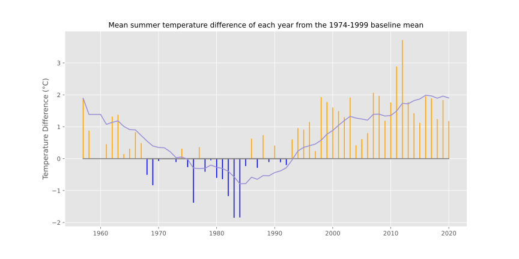
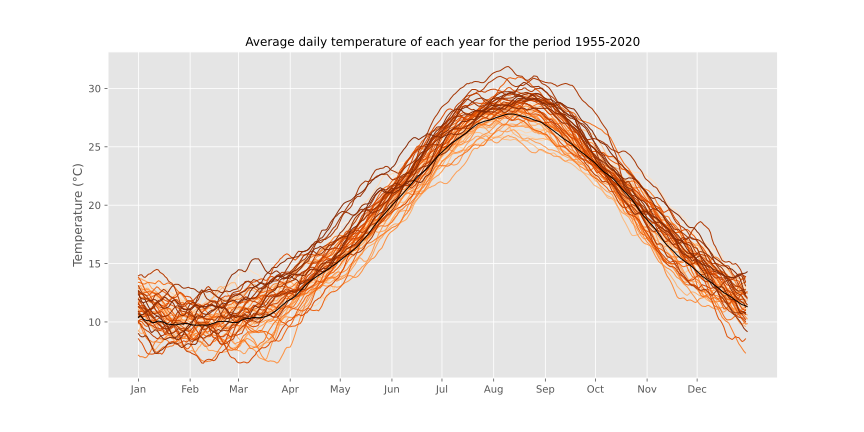
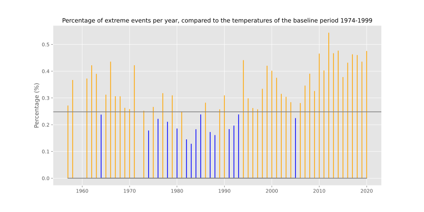
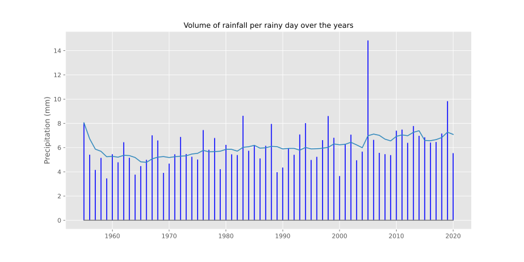

# Athens Weather Analysis

*Practical Data Science*  
*MSc in Data Science, Department of Informatics*  
*Athens University of Economics and Business*

## *Table of Contents*
1. [Introduction](#introduction)
2. [Project Overview](#project-overview)
3. [Data](#data)
4. [Resources](#resources)
5. [Analysis](#analysis)

## *Introduction*

- Athens is the capital and largest city of Greece and one of the world's oldest cities
- Athens is, also, known for its hot-summer Mediterranean climate and is the hottest city in mainland Europe
- The dominant feature of Athens' climate is alternation between hot and dry summers and mild, wetter winters
- With an avg. of 433mm of yearly precipitation, rainfall occurs largely between the months of October and April
- July and August are the driest months when thunderstorms occur sparsely

## *Project Overview*

- The scope of this project was to explore the weather in Athens over a period of more than 50 years (1955-2020)
- For this purpose we used data collected from the Hellinikon meteorological station
- The analysis was mainly focused on four themes:
  - The *deviation of summer temperatures*
  - The *evolution of daily temperatures*
  - The *extreme temperature events*
  - The *precipitation*

## *Data*

- The data were acquired from two sources:
  - [National Oceanic and Atmospheric Administration's National Centers for Environmental Information](https://www.ncdc.noaa.gov/cdo-web/search)
  - [Hellenic Data Service](https://data.hellenicdataservice.gr/dataset/66e1c19a-7b0e-456f-b465-b301a1130e3f)
- The data included information on temperature, precipitation, humidity, wind speed and other characteristics

## *Resources*

- Packages: `numpy`, `pandas`, `matplotlib`, `seaborn`
- Software: Jupyter Notebook

## *Analysis*

### Deviation of Summer Temperatures

***Comment***

As shown in the graph, in the early years, the mean summer temperature was higher than in the baseline period. It appears, however, that the mean summer temperature decreased over the years and thus from the year 1968 to 1992 it was lower than that of the baseline period. However, as early as 1984 the mean summer temperature had started to increase and show an upward trend. Therefore, from 1993 to the present day, the deviation of the mean summer temperature from that of the baseline period has been increasing continuously - with some periods of decline - reaching a maximum deviation from the baseline period of almost four points in 2012. In simple terms, the temperature in Athens has been increasing continuously in recent years, which is justified by the phenomenon of climate change.
   

### Evolution of Daily Temperatures

***Comment***

The graph shows the daily temperature, for each year from 1955 to 2020, over the course of a year. The lines representing the years are coloured from light orange to dark orange, progressing through the years in ascending order. The first thing we see, and of course we know this, is that in the summer months the temperature is higher, while the opposite is true in the winter months. The black line on the graph shows the average daily temperature during the baseline period, from 1974 to 1999. If we observe the graph carefully, we can see that the lines above the black line are darker than those below it. And in general, the lines higher up on the graph tend to be darker than the lines lower down. This could be interpreted as the daily temperature gradually increasing over the years. This conclusion is also confirmed by the data we obtained from the first graph.
   

### Extreme Temperature Events

***Comment***

The graph shows the ratio of extreme temperature events to the number of available observations per year. The baseline period for defining an event as extreme or not is the period from 1974 to 1999 and the temperatures observed during this period. If we observe the graph, we see the same trend we saw in the two previous graphs. The ratio of extreme temperature events seems to have a downward trend - with some local peaks - from 1955 to 1983, a period during which, as we observed earlier, the temperature was also gradually decreasing. From 1984 onwards, the ratio of extreme temperature events starts to increase, although there are also some decreases, following the upward trend in temperature that we also observed earlier.
   

### Precipitation

***Comment***

This graph shows the volume of rainfall over rainy days for each year. To calculate this value, the total rainfall volume for the year is divided by the total number of rainy days in the year. To understand this better, we will focus on the blue line on the graph, which represents the 10-year rolling average of the value of the above fraction. If we observe the blue line we will see that it has a slow but steady upward trend over the years. This means that the volume of rainfall per rainy day is increasing over the years. And this can happen either because the numerator of the fraction is increasing or because the denominator is decreasing. Therefore, it can be interpreted in two ways: either that the volume of rainfall increases over time, or that the number of rainy days decreases. The second scenario seems more likely since, as we observed from the previous graphs, the temperature increases over the years due to the climate change phenomenon. Therefore, it is likely that this increase in temperature is accompanied by fewer rainy days throughout the year, and hence we have rain in more concentrated bursts.
