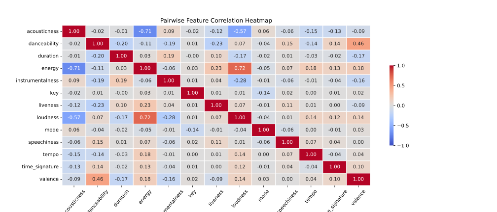
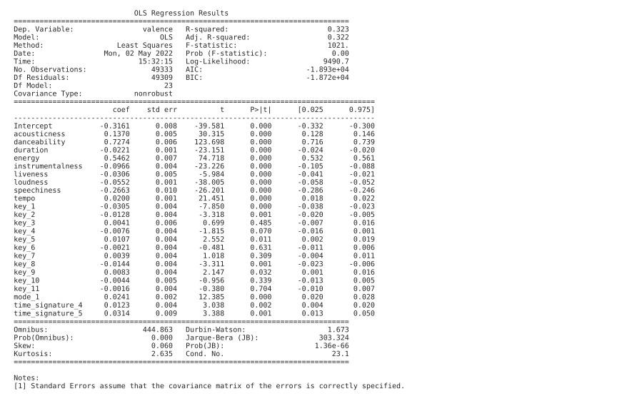
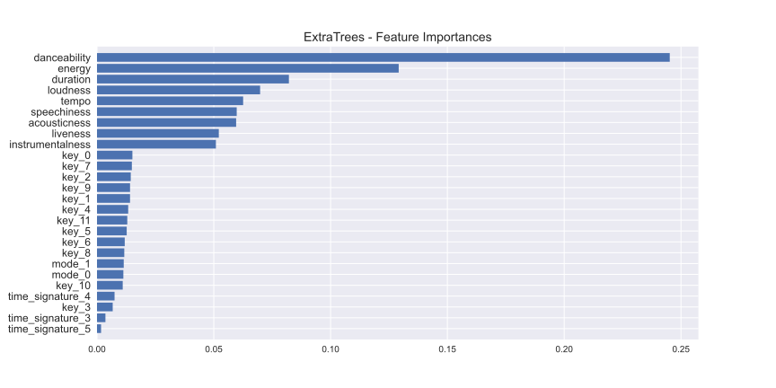
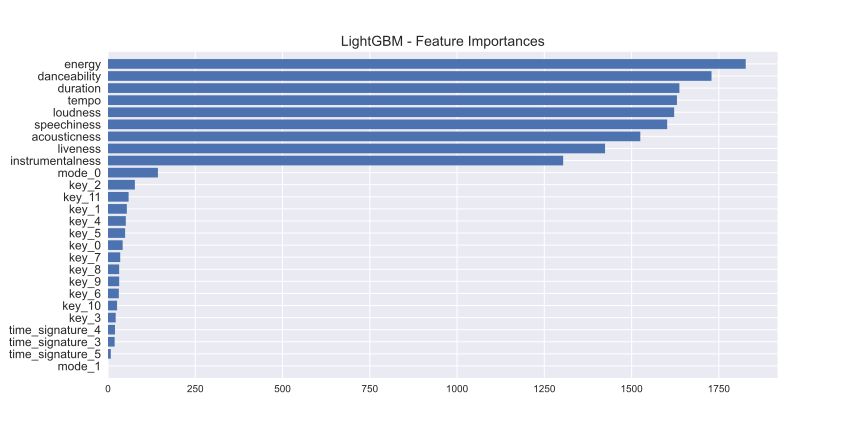

# Dissecting Spotify Valence

*Practical Data Science*  
*MSc in Data Science, Department of Informatics*  
*Athens University of Economics and Business*

## *Table of Contents*
1. [Introduction](#introduction)
2. [Project Overview](#project-overview)
3. [Data](#data)
4. [Resources](#resources)
5. [Statistical Analysis](#statistical-analysis)
6. [Predictions](#predictions)
7. [Conclusion](#conclusion)

## *Introduction*

- Spotify is a Swedish audio streaming and media services provider, founded on 23 April 2006
- It is one of the largest music streaming service providers, with over 422 million monthly active users
- Spotify uses a metric called valence that describes the musical positiveness conveyed by a track
- Tracks with high valence sound more positive (happy, cheerful, euphoric)
- While tracks with low valence sound more negative (sad, depressed, angry)
- The metric itself, however, was not developed by Spotify
- It was developed by [Echo Nest](https://en.wikipedia.org/wiki/The_Echo_Nest), a company that was bought by Spotify in 2014
- We don't know exactly how valence is calculated, but some details are given by [this](https://web.archive.org/web/20170422195736/http://blog.echonest.com/post/66097438564/plotting-musics-emotional-valence-1950-2013) blog post

## *Project Overview*

- Our aim in this project is to untangle the mystery behind valence and examine how it is derived
- For this purpose we will download tracks and their audio features using the Spotify Web API
- The audio features contain track information such as acousticness, duration, energy, valence and many more
- More details about the audio features can be found [here](https://developer.spotify.com/documentation/web-api/reference/#/operations/get-several-audio-features)
- As a first step, we will try to understand the relationships between the different audio features
- In addition, we will use inferential statistic methods to study how different audio features influence valence
- Then, we will investigate whether we can successfully predict the valence of a song using machine learning
- We will make predictions for both the initial test set and a sample of Spotify's top streaming charts

## *Data*
- The data were acquired from Spotify, via [Web API](https://developer.spotify.com/documentation/web-api/), and [Zenodo](https://zenodo.org/record/4778563)
- In particular, more than 50K songs were downloaded from Spotify along with their features
- Also, more than 200K top streaming charts were collected from Zenodo

## *Resources*
- Packages: `numpy`, `pandas`, `matplotlib`, `seaborn`, `scipy`, `statsmodels`, `sklearn`, `xgboost`, `lightgbm`
- Software: Jupyter Notebook

## *Statistical Analysis*

### Pairwise Feature Correlation

- In statistics, the ***Pearson Correlation Coefficient*** is a measure of linear correlation between two sets of data
- We use Pearson's r to measure whether there is a linear relationship between any pair of features
- The correlation coefficient ranges from -$1$ to +$1$
- An absolute value of $1$ implies that a linear equation describes the relationship between $X$ and $Y$ perfectly
- A value of +$1$ implies that all data points lie on a line for which $Y$ increases as $X$ increases
- On the other hand, a value of −$1$ implies that all data points lie on a line for which $Y$ decreases as $X$ increases
- A value of $0$ implies that there is no linear dependency between the variables

- It seems that there are two pairs of strongly linearly correlated features
- `acousticness` and `energy` have a strong *negative linear correlation*
- `energy` and `loudness` have a strong *positive linear correlation*
- The rest of the pairs are either moderately or weakly linearly correlated

### OLS Regression

*Hypothesis*

- $H0:$ There is a linear relationship between `feature_name` and **valence** 
- $H1:$ There is no linear relationship between `feature_name` and **valence** 

*Results*

- We reject the null hypothesis ($H0$) if **p-value** $< 0.05$
- Any feature with **p-value** $< 0.05$ is considered statistically significant for valence

## *Predictions*

|     | MAE | RMSE | MSE | $R^{2}$ |
| :-- | :-: | :--: | :-: | :-----: |
| ExtraTrees (on test set) | 0.131785 | 0.171791 | 0.029512 | 0.502341 |
| RandomForest (on test set) | 0.135982 | 0.172833 | 0.029871 | 0.496285 |
| LightGBM (on test set) | 0.139913 | 0.175695 | 0.030869 | 0.479463 |
| ExtraTrees (on a sample of top streaming charts) | 0.072683 | 0.126828 | 0.016085 | 0.650837 |

## *Conclusion*

Combining the results obtained from the statistical analysis on the most significant features and the feature importances retrieved from the regressors, we could conclude that the features that most influence the valence metric are ***danceability***, ***energy*** and ***duration***. This is something we might have expected. In fact, it makes perfect sense, since during happy and euphoric songs we tend to spend more energy dancing. Furthermore, the best performing regressor seemed to be ***ExtraTrees*** yielding a ***Mean Absolute Error*** of approximately $0.132$ on the test set and approximately $0.073$ on a random sample of Spotify's top-streaming charts.
