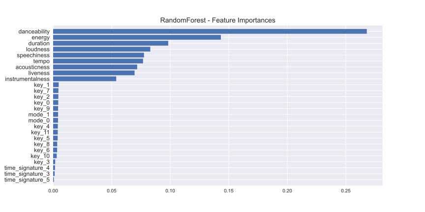

# *Dissecting Spotify Valence*

## *Table of Contents*
- [***Introduction***](#introduction)
- [***Project Overview***](#project-overview)
- [***Data***](#data)
- [***Statistical Analysis***](#statistical-analysis)
- [***Predictions***](#predictions)
- [***Conclusion***](#conclusion)

## *Introduction*

- Spotify is a Swedish audio streaming and media service provider, founded on 23 April 2006
- It is one of the largest music streaming service providers, with over 422 million monthly active users
- Spotify uses a metric called valence that describes the musical positiveness conveyed by a track
- Tracks with high valence sound more positive (happy, cheerful, euphoric)
- On the other hand, tracks with low valence sound more negative (sad, depressed, angry)
- The metric itself, however, was not developed by Spotify
- It was developed by [Echo Nest](https://en.wikipedia.org/wiki/The_Echo_Nest), a company that was bought by Spotify in 2014
- We don't know exactly how valence is calculated, but some details are given by [this blog post](https://web.archive.org/web/20170422195736/http://blog.echonest.com/post/66097438564/plotting-musics-emotional-valence-1950-2013)

## *Project Overview*

- Our aim in this project was to untangle the mystery behind valence and examine how it is derived
- For this purpose we downloaded tracks along with their audio features using the Spotify Web API
- The audio features contained track information such as acousticness, duration, energy, valence and many more
- More details about the audio features can be found [here](https://developer.spotify.com/documentation/web-api/reference/#/operations/get-several-audio-features)
- As a first step, we tried to understand the relationships between the different audio features
- In addition, we used inferential statistic methods to study how different audio features influence valence
- Then, we investigated whether we can successfully predict the valence of a song using machine learning
- We made predictions for both the initial test set and a sample of Spotify's top streaming charts

## *Data*
- The data were obtained from Spotify, via [Web API](https://developer.spotify.com/documentation/web-api/), and [Zenodo](https://zenodo.org/record/4778563)
- In particular, more than 50K songs were downloaded from Spotify along with their features
- Also, more than 200K top streaming charts were collected from Zenodo

## *Statistical Analysis*

### *Pairwise Feature Correlation*

- In statistics, the ***Pearson Correlation Coefficient*** is a measure of linear correlation between two sets of data
- We used Pearson's r to measure whether there is a linear relationship between any pair of features
- The correlation coefficient ranges between $-1$ and $+1$
- An absolute value of $1$ implies that a linear equation describes the relationship between $X$ and $Y$ perfectly
- A value of $+1$ implies that all data points lie on a line for which $Y$ increases as $X$ increases
- On the other hand, a value of $-1$ implies that all data points lie on a line for which $Y$ decreases as $X$ increases
- A value of $0$ implies that there is no linear dependency between the variables

- We observed that there were two pairs of strongly linearly correlated features
- `acousticness` and `energy` had a strong *negative linear correlation*
- `energy` and `loudness` had a strong *positive linear correlation*
- The rest of the pairs were either moderately or weakly linearly correlated

### *OLS Regression*

*Hypothesis*

- $H0:$ There is a linear relationship between `feature_name` and `valence` 
- $H1:$ There is no linear relationship between `feature_name` and `valence` 

*Results*

- We reject the null hypothesis $(H0)$ if $p-value < 0.05$
- Any feature with $p-value < 0.05$ is considered statistically significant for `valence`

## *Predictions*

- After the statistical analysis, we did some extra data preprocessing and feature engineering to improve the quality of our data
- We also used `GridSearchCV` to fine-tune some of the hyperparameters of our models
- Finally, we made predictions on both the original test set and a new sample of Spotify's top-streaming charts downloaded from [Zenodo](https://zenodo.org/record/4778563)
- The results for each set can be seen below:

| Regressors | MAE | RMSE | MSE | $R^{2}$ |
| :--------- | :-: | :--: | :-: | :-----: |
| `ExtraTrees` *(on test set)* | $0.132$ | $0.172$ | $0.030$ | $0.502$ |
| `RandomForest` *(on test set)* | $0.136$ | $0.173$ | $0.030$ | $0.496$ |
| `LightGBM` *(on test set)* | $0.140$ | $0.176$ | $0.031$ | $0.480$ |
| `ExtraTrees` *(on a sample of top streaming charts)* | $0.073$ | $0.127$ | $0.016$ | $0.651$ |

## *Conclusion*

Combining the results obtained from the statistical analysis on the most significant features and the feature importances retrieved from the regressors, we could conclude that the features that most influence `valence` are `danceability`, `energy` and `duration`. This is something we might expected. In fact, it makes perfect sense, since during happy and euphoric songs we tend to spend more energy dancing. Moreover, the best performing regressor was ***ExtraTrees*** yielding a ***Mean Absolute Error*** of approximately $0.132$ on the test set and approximately $0.073$ on a random sample of Spotify's top-streaming charts.
