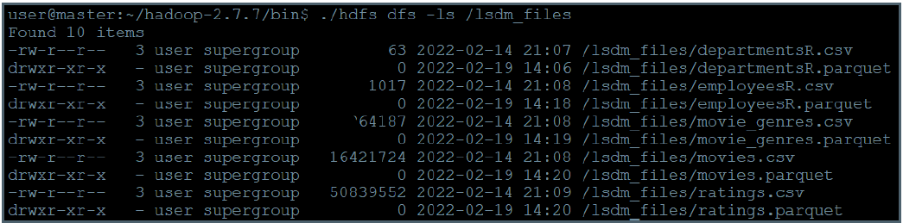
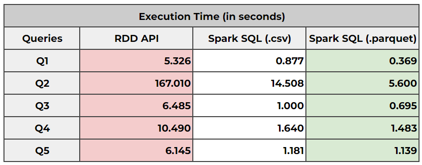
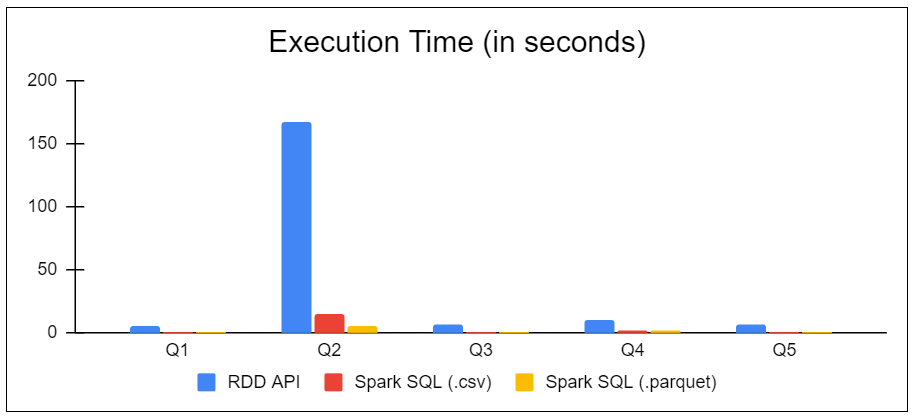

# *Using Apache Spark to Execute Queries*

## *Table of Contents*
- [***Introduction***](#introduction)
- [***Data***](#data)
- [***Task 1***](#task-1)
- [***Task 2***](#task-2)
- [***Task 3***](#task-3)
- [***Task 4***](#task-4)
- [***Task 5***](#task-5)
- [***Conclusion***](#conclusion)

## *Introduction*

- For the final project, we used the Apache Spark to execute queries on datasets
- There are two basic APIs for query execution, the [RDD API](https://spark.apache.org/docs/2.4.4/rdd-programming-guide.html) and the [DataFrame/SQL API](https://spark.apache.org/docs/2.4.4/sql-programming-guide.html)

## *Data*

- The data files were provided in the context of the course content
- The files were in `csv` format and executing queries in this format is not efficient
- To optimize data access, databases traditionally load data into a specific designed binary format
- Spark has a similar approach too and we can convert datasets to a special format named `parquet`
- The `parquet` file format is a columnar file format and you can read more about it [in this link](https://parquet.apache.org/)
- The `parquet` file format has major benefits:
  - *It has smaller footprint in memory and disk and therefore optimizes I/O, reducing execution time*
  - *It maintains additional information, such as statistics on the dataset, which helps on more efficient processing*

## *Task 1*

- We created a files directory on HDFS and uploaded the `csv` files
- We also convert the files to `parquet` and uploaded them on HDFS as well
- The commands used are as follows:
  - `./hdfs dfs -mkdir /lsdm_files`
  - `./hdfs dfs -mv /departmentsR.csv /lsdm_files/departmentsR.csv`
  - `./hdfs dfs -mv /departmentsR.csv /lsdm_files/employeesR.csv`
  - `./hdfs dfs -mv /departmentsR.csv /lsdm_files/movie_genres.csv`
  - `./hdfs dfs -mv /departmentsR.csv /lsdm_files/movies.csv`
  - `./hdfs dfs -mv /departmentsR.csv /lsdm_files/ratings.csv`

## *Task 2*

- Using RDDs, we wrote code to answer some queries
- We could use either the `csv` or `parquet` files we uploaded on HDFS
- The queries and the code can be found [here](https://github.com/sapaladas/msc_data_science/blob/main/q2-large_scale_data_management/using_apache_spark_to_execute_queries/queries/rdd_queries.py)

## *Task 3*

- Using DataFrames, we wrote code to answer some queries
- We should use the `parquet` files we created and uploaded on HDFS
- The queries and the code can be found [here](https://github.com/sapaladas/msc_data_science/blob/main/q2-large_scale_data_management/using_apache_spark_to_execute_queries/queries/dataframe_queries.py)

## *Task 4*

- Using Spark SQL, we wrote code to answer some queries
- We should use both the `csv` and `parquet` files we uploaded on HDFS
- The queries and the code can be found [here](https://github.com/sapaladas/msc_data_science/blob/main/q2-large_scale_data_management/using_apache_spark_to_execute_queries/queries/sql_queries_csv.py) (`csv`) and [here](https://github.com/sapaladas/msc_data_science/blob/main/q2-large_scale_data_management/using_apache_spark_to_execute_queries/queries/sql_queries_parquet.py) (`parquet`)

## *Task 5*

- For every query, we measured the execution time of each of the following scenarios:
  - *1. Map/Reduce - RDD API*
  - *2. Spark SQL on `csv` files*
  - *3. Spark SQL on `parquet` files*
- Finally, we created a bar chart with the execution times grouped by each query
- The results of each of the aforementioned scenarions can be seen below

## *Conclusion*

- According to the graph, it is obvious that we had a clear winner in terms of execution times
- Using Spark SQL on `parquet` files to execute the queries seemed to be the fastest way for someone to proceed with
- On the other hand, MapReduce using the RDD API seemed to be by far the slowest and less efficient choice
