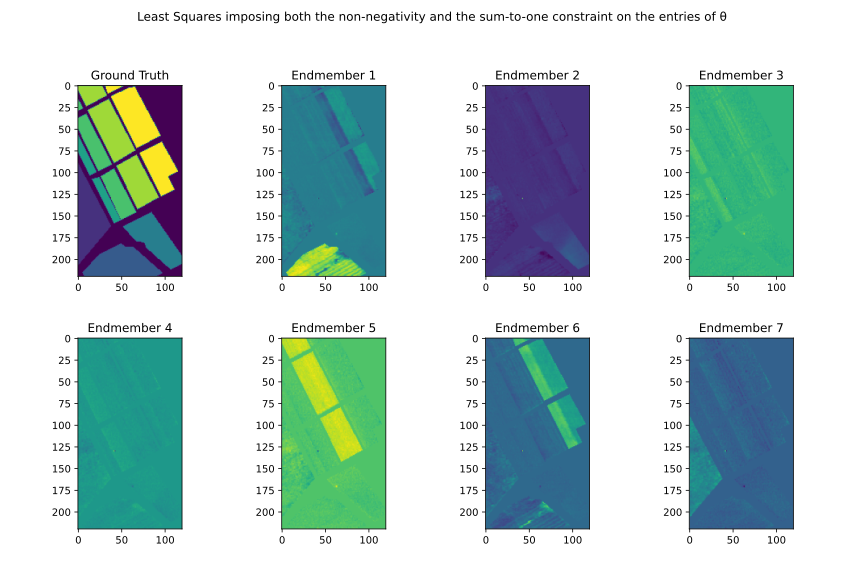
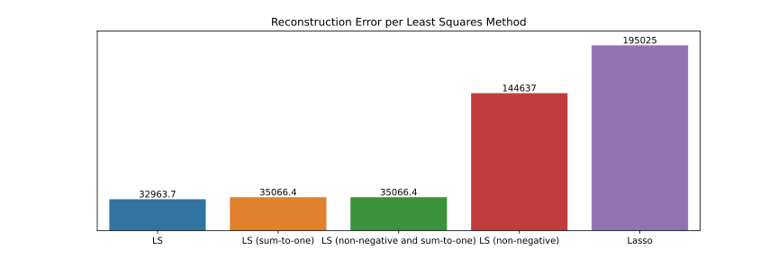

# Hyperspectral Images Processing

*Machine Learning and Computational Statistics*  
*MSc in Data Science, Department of Informatics*  
*Athens University of Economics and Business*

## *Table of Contents*
1. [Introduction](#introduction)
2. [Project Overview](#project-overview)
3. [Data](#data)
4. [Resources](#resources)
5. [Part 1 - Spectral Unmixing](#part-1---spectral-unmixing)
    - [Abundance Maps](#abundance-maps)
    - [Reconstruction Errors](#reconstruction-errors)
    - [Comment](#comment)
6. [Part 2 - Classification](#part-2---classification)
    - [Performance](#performance)
    - [Comment](#comment)
7. [Conclusion](#conclusion)

## *Introduction*

- A hyperspectral image depicts a specific scene at several $(L)$ narrow continuous spectral bands
- It can be represented by a $M \times N \times L$ three dimensional cube
- The first two dimensions correspond to the spatial information
- The third dimension corresponds to the spectral information
- Thus, the $(i,j)$ pixel in such an image, $i=1,...,M$, $j=1,...,N$, is represented by an $L$-dimensional vector
- This $L$-dimensional vector is called the ***spectral signature*** of the pixel

- In several remote sensing applications, the hyperspectral images are taken from satellites
- In such cases, they depict specific scenes of the earth surface at a specific spatial resolution
- That is, a single pixel may represent an area from $3 \times 3m^{2}$ to $100 \times 100m^{2}$ or more
- Each pixel is likely to depict more than one materials depicted in the corresponding area of the scene
- Such pixels are called ***mixed pixels*** and they are the vast majority of the pixels in the image
- On the other hand, there are (usually) a few pixels that depict a single material, called ***pure pixels***

## *Project Overview*

- In this project, we deal with usual procedures for processing hyperspectral images
- The usual processing procedures follow two main directions, the ***spectral unmixing*** and the ***classification***

#### Spectral Unmixing

- Assume that a set of $m$ spectral signatures corresponding to the pure pixels in the HSI under study is given
- For a given pixel, the aim is to determine the percentage to which each material contributes in its formation
- These percentages are known as the ***abundance maps*** for the given pixel
- Therefore it is clear that spectral unmixing provides ***sub-pixel information*** for a given pixel

#### Classification

- Assume that all pixels in the HSI under study are known to belong to one out of $m$ ***known classes***
- Given a specific pixel, the aim is to determine the most suitable class to assign it

## *Data*

- The data were provided in the context of the course content
- The data refer to the so called ***"Salinas" HSI***, which depicts an area of the Salinas valley in California, USA
- It is a $220 \times 120$ spatial resolution HSI
- It consists of $204$ spectral bands (from $0.2μm$ – $2.4μm$) and its spatial resolution is $3.7m$
- That is, the HSI is a $220 \times 120 \times 204$ cube

## *Resources*
- Packages: `numpy`, `pandas`, `matplotlib`, `seaborn`, `scipy`, `sklearn`
- Software: Jupyter Notebook

## *Part 1 - Spectral Unmixing*

- The "Salinas" HSI includes ***7 endmembers***
- Each one corresponds to a certain material, or cultivation in our case
- The cultivations are *grapes, broccoli, fallow 1, fallow 2, fallow3, stubble, celery*
- The aim is to perform unmixing on each of the pixels in the image with **non-zero label**, wrt the 7 endmembers
- For this task, the following five different spectral unmixing methods will be used:
  - *Least squares*
  - *Least squares imposing the sum-to-one constraint*
  - *Least squares imposing the non-negativity constraint on the entries of θ*
  - *Least squares imposing both the non-negativity and the sum-to-one constraint on the entries of θ*
  - *LASSO, i.e., impose sparsity on θ via L1 norm minimization*
- For each method:
  - Derive the corresponding ***7 abundance maps*** (one for each endmember/material)
  - Compute for each pixel $y_{i}$ the ***reconstruction error***

### Abundance Maps

### Reconstruction Errors

### Comment

In general, the optimal spectral unmixing method should result in abundance maps where each of them depicts only the pixels corresponding to the respective class. In our case, by comparing the results obtained from the different methods, we can clearly observe that there are two methods that perform significantly better than the others. In particular, Non-Negative LS and LASSO managed to separate the material to a great extent. On the other hand, when we consider the reconstruction error of each method, we have a completely different story. OLS yields the lowest reconstruction error, while both Non-Negative LS and LASSO have by far the worst performance.

This strange behavior, though, might have an explanation. LS methods with inequality constraints and regularizations are much more difficult to solve as a minimization problem, than those with equality or no constraints at all. Therefore, this could lead us to the conclusion that the reconstruction error might not be the right source of truth when it comes to measure the spectral unmixing performance, and that the abundance maps obtained from constrained LS methods return a better representation of the ground truth.

## *Part 2 - Classification*

- In this case, we consider also the image pixels with **non-zero class labels**
- The task is to assign each one of them to the most appropriate class, among the ***7 known classes***
- To this end, four classifiers will be used:
  - *The Naive Bayes classifier*
  - *The Minimum Euclidean Distance classifier*
  - *The K-Nearest Neighbor classifier*
  - *The Bayesian Classifier*
- For each classifier:
  - Train it based on the training set performing a 10-fold cross validation
  - Report the estimated validation error as the mean of the ten resulting error values
  - Compute, also, the associated standard deviation
  - Use the whole training set to train the classifier and evaluate their performance on the test set

### Performance

### Comments

- Comparing the results, we see that there are great differences between their respective errors
- However, if we compare their success rates, we see that their performance is almost at the same level
- Therefore, if we take into account both their errors and their success rates, we see that we have a clear winner
- KNN classifier not only has the best overall success rate, but also the lowest error
- On the other hand, the worst performing classifier seems to be the Minimum Euclidean Distance classifier
- It is clear from the graph above that it ranks last in terms of error and success rate
- The same conclusion can, also, be drawn if we look at its confusion matrix in the [notebook](https://github.com/sapaladas/hyperspectral_images_processing/blob/main/hyperspectral_images_processing.ipynb)
- It has more non-diagonal values than the other classifiers, which means that it has more misclassified data

## *Conclusion*

In the project, we focused on hyperspectral images processing and performed spectral unmixing and classification tasks. In the fist part, spectral unmixing, we used various least squares methods (both ordinary and constrained) to estimate the relationship between the 7 endmembers and the spectral signature of each pixel in the image. In the second part, classification, we used 4 different classification algorithms and tried to predict the class to which each pixel in the given test set belongs.

Having performed both tasks, we can see some correlation between the results obtained from the spectral unmixing procedure and those obtained from the classification. By deriving the abundance maps for each endmember, what we tried to do is that we tried to classifiy each pixel into one of the 7 endmembers (classes). So, in effect, by deriving the abundance maps we tried to show where in the image (on the ground) we have finally classified (placed) each of the 7 endmembers (materials).
