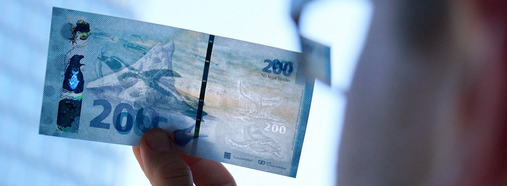
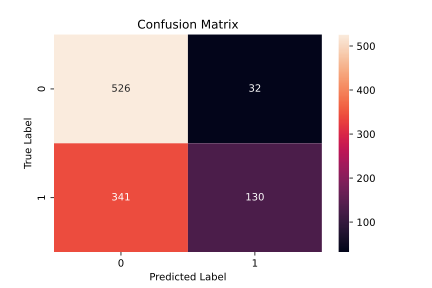
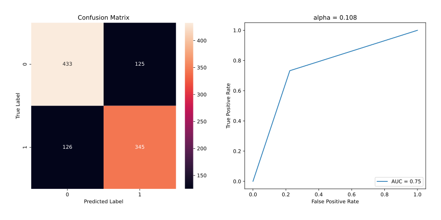
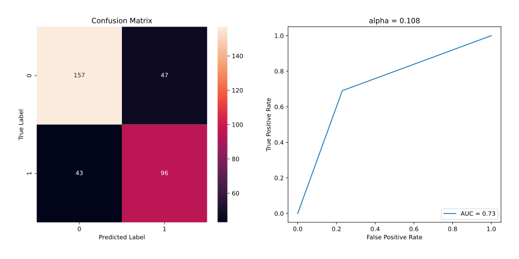
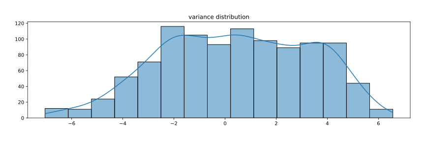
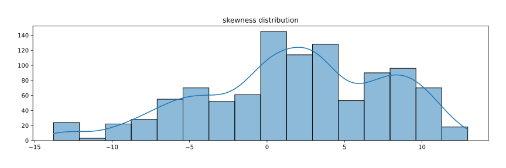
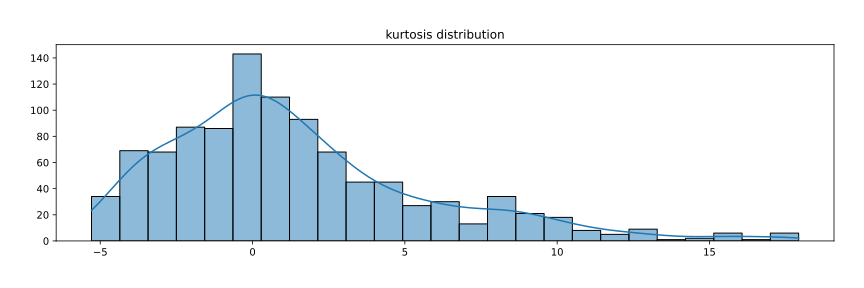
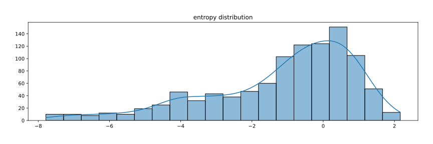
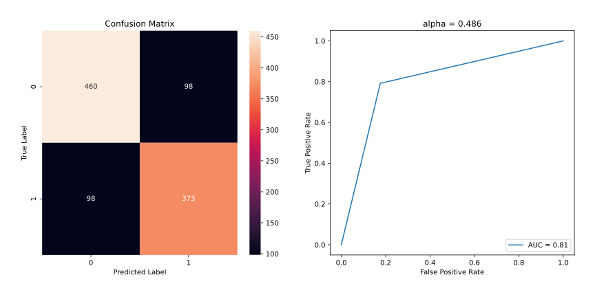

# Banknote Authentication via Least Squares

*Numerical Optimization and Large Scale Linear Algebra*  
*MSc in Data Science, Department of Informatics*  
*Athens University of Economics and Business*



## *Table of Contents*

1. [Project Overview](#project-overview)
2. [Data](#data)
3. [Resources](#resources)
4. [Predictions](#predictions)
5. [Conclusion](#conclusion)

## *Project Overview*

- The scope of this project was to predict whether a given banknote is authentic given a number of measures
- We used the least squares procedure to create a classifier
- We classified our items based on the following assumption:
    - *"If the prediction value > 0.5, then we classify the item as 1, otherwise as 0"*
- Next, we computed the confusion matrix for the training set
- We checked the number of FN and FP to see if there was a serious imbalance
- Then we tried to find a value of $\alpha$ which balances the two numbers
- For the optimal value of $\alpha$, we ran the model for the test set
- We computed, again, the confusion matrix and the error rate for both sets
- Finally, we used any appropriate transformation technique to increase the accuracy of the model

## *Data*

- The data were provided in the context of the course content
- However, they are also available in the [UCI Machine Learning Repository](https://archive-beta.ics.uci.edu/ml/datasets/banknote+authentication)
- The data were extracted from images that were taken from genuine and forged banknote-like specimens
- For digitization, an industrial camera usually used for print inspection was used
- The final images had $400 \times 400$ pixels
- Wavelet Transform tool were used to extract features from images
- The dataset contains banknote image features such as variance, skewness, curtosis and entropy

## *Resources*

- Packages: `numpy`, `pandas`, `matplotlib`, `seaborn`, `scipy`, `sklearn`
- Software: Jupyter Notebook

## *Predictions*

- For our predictions, we built a least squares classifier with a starting value of 0.5 for $\alpha$
- We classified our items based on the following assumption:
    - *"If the prediction value > 0.5, then we classify the item as 1, otherwise as 0"*
- The least squares classifier function we built is shown below

### Least Squares Classifier

``` python
def least_squares_classifier(x_set, y_set, alpha=0.5):
    
    # function to calculate theta estimates
    # aka coefficients for each feature
    def get_thetas(X, Y):
        thetas = np.dot(np.linalg.inv(np.dot(X.T,X)), np.dot(X.T,Y))
        return thetas
    
    # get thetas (coefficients)
    thetas = get_thetas(x_set, y_set)
    
    # make predictions
    preds = np.dot(x_set, thetas) 
    y_set['preds'] = preds
    
    # classify the predictions
    y_set['predicted_class'] = np.where(y_set.preds - alpha > 0, 1, 0)
    
    return y_set

# execute function
y_train = least_squares_classifier(x_train, y_train)
```

- After creating our classifier, we computed the confusion matrix of the training set
- We wanted to investigate how our classifiers performs and see if we needed to adjust $\alpha$
- The results of the first iteration is shown below

### Confusion Matrix of the Training Set



- We see that there was a serious imbalance between *false negative* and *false positive* predictions
- Therefore, we tried to find - *heuristically* - a value of $\alpha$ that would balance the two number
- The function we built to fine tune the value of $\alpha$ is shown below

### Tuning Alpha

``` python
def tune_alpha(x_set, y_set, alphas):
    
    # initialize alpha
    best_alpha = math.pow(10,10)
    
    # initialize the difference
    # between false negative and false positive
    best_fn_minus_fp = math.pow(10,10)
    
    print('Searching for best alpha...')
    
    # loop through alphas
    for alpha in alphas:
        
        # make predictions
        y_set = least_squares_classifier(x_set, y_set, alpha)
        
        # compute confusion matrix
        conf_matrix = confusion_matrix(y_set.iloc[:,0], y_set.iloc[:,-1])
        tn, fp, fn, tp = confusion_matrix(y_set.iloc[:,0], y_set.iloc[:,-1]).ravel()
        
        # compute the difference
        # between false negative and false positive
        # for the alpha in loop
        fn_minus_fp = abs(fn-fp)
        
        # store best results
        if fn_minus_fp < best_fn_minus_fp:
            best_alpha = alpha
            best_fn_minus_fp = fn_minus_fp
            
    print('Searching for best alpha... Found!', end='\n\n')
    print(f'The difference between FP and FN is {best_fn_minus_fp}.', end='\n\n')
    print(f'The best value of alpha is {round(best_alpha,3)}.')
    
    return best_alpha

# list of alphas to try
alphas = np.arange(-2, 2, 0.001)

# execute the function
alpha = tune_alpha(x_train, y_train, alphas)
```

- Thus, following the procedure above, we managed to find the optimal value of $\alpha$
- Then we ran the model both for training and test set
- For each set, we calculated the error rate and computed the confusion matrix and the ROC curve

### Results for Train Set



### Results for Test Set



- We see that we managed to balance the number between *false negatives* and *false positives* responses
- However, we didn't get the best possible results yet and there was room for improvement
- A great way to increase the accuracy of our results would be to scale the feature values prior training
- To decide which type of scaling to apply, we ran the *Shapiro-Wilk* test
- We took a random sample of 1000 data points to examine
- We tried to detect whether the population of features under consideration was normally distributed

### Shapiro-Wilk Test

*Hypothesis*

- $H0:$ The sample (obtained from `feature_name`) comes from a normal distribution
- $H1:$ The sample (obtained from `feature_name`) does not come from a normal distribution

*Results*

- Reject the null hypothesis if $p$-value < 0.05






- According to the graphs, none of the features seemed to follow a normal distribution
- In addition, the $p$-value obtained from Shapiro-Wilk was less than 5% for all the features
- That indicated that none of the samples tested came from a normal distrubution
- Therefore, we rejected the null hypothesis and we *normalized* our data using `MinMaxScaler`
- Finally, we found the *new* optimal value of $\alpha$ and computed, again, the confusion matrices and ROC curves

### Results for Train Set After Normalization



### Results for Test Set After Normalization


## *Conclusion*

- We see that scaling our features resulted in different optimal values for $\alpha$
- Looking at the test set, we also observe different results regarding the difference between FP and FN
- Even though after scaling the difference between FP and FN was higher than before, the error rate was smaller
- Finally, we see that when the model is trained on the scaled features, it yields a higher AUC score
