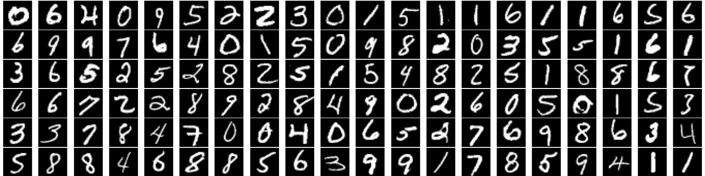
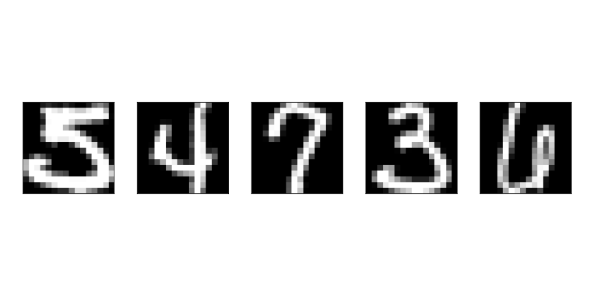
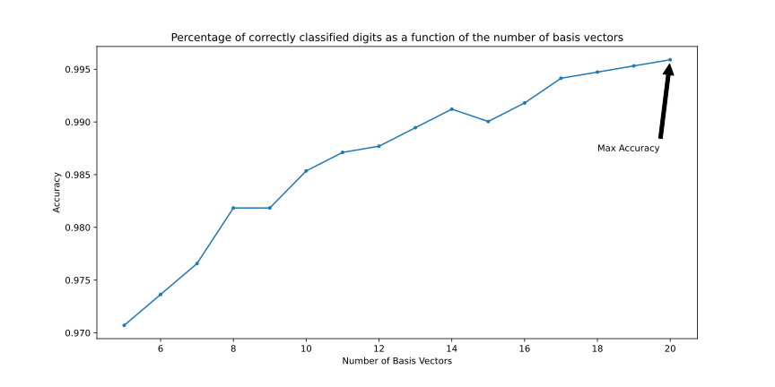
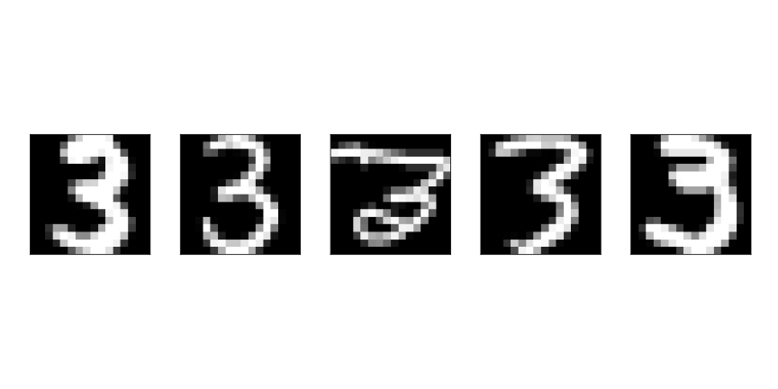
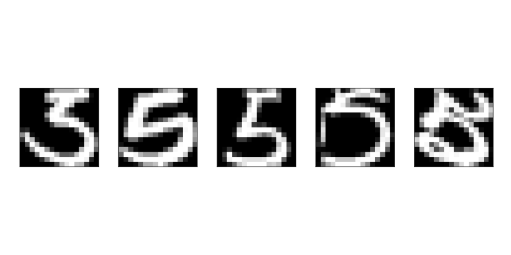
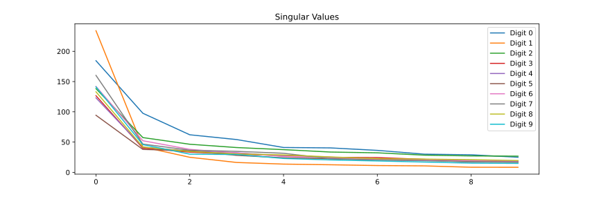

# Handwritten Digits Classification via SVD

*Numerical Optimization and Large Scale Linear Algebra*  
*MSc in Data Science, Department of Informatics*  
*Athens University of Economics and Business*

## *Table of Contents*

1. [Introduction](#introduction)
2. [Project Overview](#project-overview)
3. [Data](#data)
4. [Resources](#resources)
5. [Analysis & Predictions](#analysis--predictions)

## *Introduction*

- Handwritten digit recognition is the ability of a machine to recognize the human handwritten digits
- Handwritten digits can be found in many sources such as images, papers, touch screens etc.
- The machine should be able to recognize and classify them into predefined classes (0-9)
- Digit recognition has many applications like number plate recognition, bank check processing etc.

## *Project Overview*

- Our aim in this project is to construct an algorithm for classification of handwritten digits
- We use the training set to compute the SVD of each class (0-9) matrix
- Then, we create a least squares classifier which will use the relative residual vector as a measure
- In particular, the residuals will be calculated using the following formula:
$$ \frac {\lVert (I-U_{k}U_{k}^{T})z \rVert_{2}}{\lVert z \rVert_{2}} $$
- We use the first few (5-20) singular vectors as basis
- We tune the algorithm for accuracy of classification by finding the optimal number of basis vectors
- Then, we classify test digits according to how well they can be represented in terms of the respective bases
- Once we classify the digits, we check if all digits are equally easy or difficult to classify
- We take a look at some of the difficult ones to see if they were, indeed, badly written
- Then, we run again the model with different number of basis vectors for some of the digits
- Finally, we create a two-stage classifier in order to save operations in the test phase
- In the first stage we compare the unknown digit only to the first singular vector in each class
- If for one class the residual is significantly smaller than for the others, we classify as that class
- Otherwise, we perform the standard least squares classifier we initially created

## *Data*

- The data are a subset of the US Postal Service Database
- They were provided in the context of the course content
- The file `data.xslx` contains both training and test data
- The sheet `"azip"` (`"testzip"`) holds the training (test) images as an array of dimension $256\times107$
- The images are vectors of dimension $256$, that have been constructed from $16\times16$ images
- The sheet `"dzip"` (`"dtest"`) holds the digits (numbers) as a vector of dimension $1\times1707$

## *Resources*

- Packages: `numpy`, `pandas`, `matplotlib`, `seaborn`, `sklearn`
- Software: Jupyter Notebook

## *Analysis & Predictions*

### SVD & Classification

- In linear algebra, the ***singular value decomposition (SVD)*** is a factorization of a real or complex matrix
- It generalizes the factorization of a square normal matrix with orthonormal eigenbasis to any $m \times n$ matrix
- It is related to the polar decomposition
- Specifically, the *SVD* of an $m \times n$ complex matrix $M$ is a factorization of the form $M = U \Sigma V^{*}$
- $U$ is an $m \times m$ complex unitary matrix
- $Σ$ is an $m \times n$ rectangular diagonal matrix with non-negative real numbers on the diagonal
- V is an $n \times n$ complex unitary matrix
- If $M$ is real, $U$ and $V$ can also be guaranteed to be real orthogonal matrices
- In such contexts, the *SVD* is often denoted $U \Sigma V^{T}$
- The diagonal entries  $\sigma_{i}=\Sigma_{ii} $ of $\Sigma$ are uniquely determined by $M$
- They are, also, known as the singular values of $M$
- The number of non-zero singular values is equal to the *rank* of $M$
- Thus, after we perform *SVD*, we tune the number of basis vectors
- The graph below shows that using a number of 20 basis vectors, yields the highest accuracy

- Then, using the number of basis vectors found above, we run the least squares classifier to get our estimates
- We display classification metric results to see if there are any digits that are easy or hard to classify

#### Classification Report (SVD w. 20 Basis Vectors)

| Digit | Precision | Recall | F1-Score | Support |
| :---: | :-------: | :----: | :------: | :-----: |
| 0 | 0.94 | 0.99 | 0.96 | 359 |
| 1 | 0.98 | 0.98 | 0.98 | 264 |
| 2 | 0.94 | 0.90 | 0.92 | 198 |
| 3 | 0.92 | 0.89 | 0.91 | 166 |
| 4 | 0.92 | 0.94 | 0.93 | 200 |
| 5 | 0.92 | 0.88 | 0.90 | 160 |
| 6 | 0.98 | 0.96 | 0.97 | 170 |
| 7 | 0.94 | 0.95 | 0.94 | 147 |
| 8 | 0.94 | 0.90 | 0.92 | 166 |
| 9 | 0.90 | 0.94 | 0.92 | 177 |

- The model seems to be able to estimate better digits one (1) and six (6)
- On the other hand, it seems to have more difficulty in estimating digits three (3) and five (5)
- The figures below show cases where some digits three and five are very badly written
- In some cases, they are so badly written that can be mistaken even by a human
- We can even see the first case of digit 5 in which the digit looks more a three than a five

### Singular Values

- Next, we want to see if it pays off to use different number of basis vectors for different digits
- For that reason, we plot the 10 first singular values of each digit
- The aim is to find the digits for which the singular values decrese the fastest

- We see that the singular values of digit 1 decrease much faster than of the rest of the digits
- Therefore, we try to see if using a different number of basis vectors for this digit yields better results
- Following the same procedure we did above, we find the optimal number of basis vectors for digit 1
- We find that the highest accuracy for digit 1 is yielded when using ***7 basis vectors***
- Next, we run again our classifier but now using 7 singular vectors for digit 1, and 20 for the rest digits

#### Results

- When using the same number of basis vectors for all digits, the accuracy is $0.93971$
- When using 7 basis vectors for digit 1 and 20 for the rest, the accuracy is $0.93672$
- We see that the results obtained from our experiment are very close, almost the same
- Thus, using a different number of basis vectors for some digits didn't seem to pay off in our case

### Two-Stage Classifier

- Finally, we create a two-stage classifier in order to save operations in the test phase
- In the first stage we compare the unknown digit only to the first singular vector in each class
- If for one class the residual is significantly smaller than for the others, we classify as that class
- Otherwise, we perform the standard least squares classifier we initially created
- We, also, tune the threshold to find the optimal *significant difference* between the first class and the others
- The table below show the results obtained using different thresholds.

| Threshold | Accuracy | Percentage of data points not using the second stage of the algorithm |
| :-------: | :------: | :-------------------------------------------------------------------: |
| 0.70 | 0.939711 | 0.204783
| 0.65 | 0.939711 | 0.155456
| 0.60 | 0.939711 | 0.124564
| 0.55 | 0.939711 | 0.111111
| 0.50 | 0.939711 | 0.099651
| 0.45 | 0.939711 | 0.092676
| 0.40 | 0.939711 | 0.079223
| 0.35 | 0.939711 | 0.064773
| 0.30 | 0.939711 | 0.050324
| 0.25 | 0.939711 | 0.027404
| 0.20 | 0.939711 | 0.009467
| 0.15 | 0.939711 | 0.002990
| 0.10 | 0.939711 | 0.000000
| 0.75 | 0.939213 | 0.277030
| 0.80 | 0.938714 | 0.360737
| 0.85 | 0.935725 | 0.478326
| 0.90 | 0.925760 | 0.612855
| 0.95 | 0.890384 | 0.778276

#### Comment

According to the results, there are certain threshold values that achieve the best accuracy in our estimates. In particular, all values between 0.10 and 0.70 (inclusive) yield an accuracy of almost 94%. However, looking at the third column which corresponds to the frequency at which the second stage of the classifier is redundant and therefore not used, we see different values. Specifically, we see that when we use a threshold of 0.70, the second stage of the classifier is not used by 20% of our data points. This value is the highest among the threshold values that achieve the highest accuracy. Therefore, choosing a threshold of 0.70 would make our model more robust both in terms of accuracy and efficiency.
