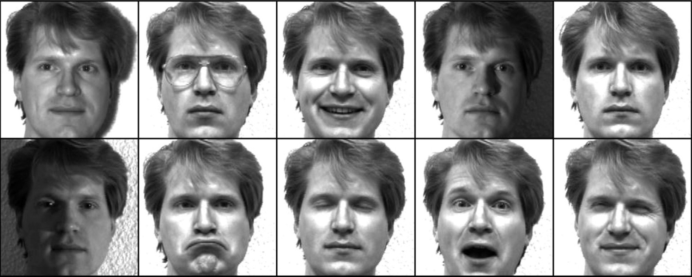

# Image Feature Extraction via PCA and kPCA

*Numerical Optimization and Large Scale Linear Algebra*  
*MSc in Data Science, Department of Informatics*  
*Athens University of Economics and Business*



## *Table of Contents*

1. [Introduction](#introduction)
2. [Project Overview](#project-overview)
3. [Standard PCA](#standard-pca)
4. [Kernel PCA](#kernel-pca)
5. [Classification Results](#classification-results)

## *Introduction*

- In this project, we replicate the example 3.2.2 of the following paper

> ***[Kernel Principal Component Analysis and its Applications in Face Recognition and Active Shape Models](https://github.com/sapaladas/image_feature_extraction_via_pca_kpca/blob/main/kernel_principal_component_analysis.pdf)***  
> *Quan Wang, Rensselaer Polytechnic Institute, 110 Eighth Street, Troy, NY 12180 USA*  
> *arXiv:1207.3538 \[cs.CV\], 2012*

- We use images from the Yale Face Database B
- It contains 5760 single light source gray-level images of 10 subjects, each seen under 576 viewing conditions
- We take 51 images of the first subject and 51 images of the third subject as the training data
- We then take 13 images of each of them as test data
- Then all the images are aligned, and each image has $168 \times 192$ pixels
- We use the $168 \times 192$ pixels intensities as the original features for each image
- Therefore, the original feature vector is $32256$-dimensional

## *Project Overview*

- We use standard PCA and Gaussian kernel PCA
- We extract the 9 most significant features from the training data and record the eigenvectors
- For standard PCA, only the eigenvectors are needed to extract features from testing data
- For Gaussian kPCA, both eigenvectors and training data are needed to extract features from the testing data
- In addition, for kernel PCA, we use a Gaussian kernel with $\sigma = 22546$
- For classification of the images, we use the simplest linear classifier

## *Standard PCA*

- The ***principal components*** of a collection of poins in a real coordinate space are a sequence of $p$ unit vectors
- The $i$-th vector is the direction of a line that best fits the data while being orthogonal to the first $i-1$ vectors
- A best-fitting line is defined as one that minimizes the average squared distance from the points to the line
- These directions form an orthonormal basis in which different individual dimensions are linearly uncorrelated
- ***PCA*** is the process of computing and using the principal components to perform change of basis on the data

### Process

1. Initialize a PCA instance 
2. Fit the PCA instance in the training data
3. Get the 9 largest eigenvectors as principal components
4. Project both training and testing data onto a lower dimensional space using the 9 largest eigenvectors

## *Kernel PCA*

- In the field of multivariate statistics, ***kernel PCA*** is an extension of PCA
- It allows for the separability of non-linear data by making use of kernels
- The basic idea behind it is to project the linearly inseparable data onto a lower dimensional space
- There, the new data becomes linearly separable

### Process

1. Compute the hyperparameter $\sigma$
2. Use Gaussian kPCA to project the training data onto a lower dimensional space and record the eigenvectors
3. Use Gaussian kPCA and the eigenvectors obtained to project the testing data onto a lower dimensional space

*Compute the hyperparameter* $\sigma$

- Calculate the pairwise distances between all data points of the input matrix
- For each data point, find the distance from its nearest neighbor
- Calculate the average of all smallest distances
- Compute  $\sigma $ using the formula  $\sigma = 5 \times mean(d_{i}^{NN}) $
- Below you can find the function used to compute $\sigma$

``` python
def compute_sigma(x):
    """
    Hyperparameter σ
    ________________
    :param x: the input data matrix, each row is one observation (M), each column is one feature (N)
    :return: the σ parameter
    ================
    step1: calculate the pairwise distances between all data points of the input matrix
    step2: find the distance, be it di^NN, of each data point xi from its nearest neighbor
    step3: calculate the mean of the smallest distances
    step4: compute σ, σ = 5 x mean(di^NN)
    """
    
    # calculate pairwise distances
    distances = pairwise_distances(x)
    distances = np.where(distances == 0, np.inf, distances)
    
    # find the distance of each data point from its nearest neighbor
    min_distances = [min(dist) for dist in distances]
    
    # calculate the avg smallest distance
    mean_distance = np.mean(min_distances)
    
    # compute sigma
    sigma = 5 * mean_distance
    
    return sigma, print(f'σ = {int(sigma)}')

# execute function
sigma, _ = compute_sigma(x_train)
```

*Project the training data onto a lower dimensional space and record the eigenvectors*

- Construct the kernel matrix using the formula $K = exp(-\| x - y \|^{2} / 2 \sigma^{2})$
- Compute the gram matrix using the formula $\tilde{K} = K - 1_{N}K - K1_{N} + 1_{N}K1_{N}$
  - where $1_{N}$ is the $N \times N$ matrix with all elements equal to $1/N$
- Compute the eigenvalues and eigenvectors of $\tilde{K}$
- Normalize the eigenvectors
- Get the k largest eigenvectors to become the principal components
- Project the input data onto a lower dimensional space using the k principal components
- Below you can find the function used to project the training data onto a lower dimensional space

``` python
def kPCA(x, sigma, n_components=9):
    """
    Kernel PCA algorithm
    ____________________
    :param x: the input data matrix, each row is one observation (M), each column is one feature (N)
    :param sigma: the hyperparameter σ
    :param n_components: the number of principal components to keep
    :return x_train_kPCA: the projection of the input data onto a lower dimensional space
    :return eigenvectors: the principal [n_components] components
    ====================
    step1: construct the kernel matrix K0
    step2: compute the gram matrix (aka center the kernel matrix) $K=K0-1_NK0-K01_N+1_NK01_N$
    step3: compute the eigenvalues and the eigenvectors of $K^C$
    step4: normalize the eigenvectors
    step5: get the k first largest eigenvectors to become principal components
    step6: project the input data onto a lower dimensional space
    """
    
    def rbf_kernel(x, sigma):
        """
        Gaussian rbf kernel
        ___________________
        :param x: the input data matrix, each row is one observation (M), each column is one feature (N)
        :param sigma: the hyperparameter σ
        :return: the rbf kernel, $e^{-||x-y||^2/2*sigma^2}$
        ===================
        step1: calculate the squared euclidean distance for every pair of points in the MxN dimensional dataset
        step2: convert the pairwise distances into a symmetric MxM matrix
        step3: compute the MxM kernel matrix
        """
        D = pdist(x,'sqeuclidean')
        D = squareform(D)
        D = np.where(D<0,0,D)
        K = np.sqrt(D)
        K = K**2
        K = np.exp(-K/(2*sigma**2))
        return K
    
    # construct the kernel matrix
    K0 = rbf_kernel(x, sigma)
    
    # compute the gram matrix
    N = x.shape[0]
    oneN = np.ones((N,N))/N
    K = K0 - np.dot(oneN,K0) - np.dot(K0,oneN) + np.dot(np.dot(oneN,K0),oneN)
    
    # eigenvalue analysis
    eigenvalues, eigenvectors = np.linalg.eigh(K)
    
    # normalization
    norm_eigenvectors = np.sqrt(sum(eigenvectors**2))
    eigenvectors = eigenvectors / np.tile(norm_eigenvectors, (eigenvectors.shape[0], 1))
    
    # dimensionality reduction
    kLargestIdx = np.argsort(eigenvalues)[::-1][:n_components]
    eigenvectors = eigenvectors[:,kLargestIdx]
    x_train_kPCA = np.dot(K0,eigenvectors)
    
    return x_train_kPCA, eigenvectors

# execute function
x_train_kPCA, eigenvectors = kPCA(x_train, sigma)
```

*Project the testing data onto a lower dimensional space*

- Construct the kernel matrix using the formula $K = exp(-\| x - y \|^{2} / 2 \sigma^{2})$
- Project the testing data onto a lower dimensional space using the kernel matrix and the k largest eigenvectors
- Below you can find the function used to project the testing data onto a lower dimensional space

``` python
def kPCA_newData(x_train, x_test, eigenvectors, sigma):
    """
    Kernel PCA algorithm for unseen data
    ____________________________________
    :param x_train: the input train data matrix, each row is one observation (M), each column is one feature (N)
    :param x_test: the input unseen data matrix, each row is one observation (M), each column is one feature (N)
    :param eigVector: the eigenvectors obtained from the previous step
    :param sigma: the hyperparameter σ
    :return x_test_kPCA: the projection of the input unseen data onto a lower dimensional space
    ====================================
    step1: construct the kernel matrix K 
    step2: compute the projection of the input data onto a lower dimensional space
    """
    
    def rbf_kernel_newData(x_train, x_test, sigma):
        """
        Gaussian rbf kernel
        ___________________
        :param x_train: the input train data matrix, each row is one observation (M), each column is one feature (N)
        :param x_test: the input unseen data matrix, each row is one observation (M), each column is one feature (N)
        :param sigma: the hyperparameter σ
        :return: the rbf kernel, $e^{-||x-y||^2/2*sigma^2}$
        ===================
        step1: calculate the squared euclidean distance for every pair of points in the MxN dimensional dataset
        step2: convert the pairwise distances into a symmetric MxM matrix
        step3: compute the MxM kernel matrix
        """
        D = pdist(np.concatenate([x_train,x_test]), 'sqeuclidean')
        D = squareform(D)
        D = np.where(D<0,0,D)
        K = np.sqrt(D)
        N = x_train.shape[0]
        K = K[N:,:N]
        K = K**2
        K = np.exp(-K/(2*sigma**2))
        return K
    
    # construct the kernel matrix
    K = rbf_kernel_newData(x_train, x_test, sigma)
    
    # dimensionality reduction
    x_test_kPCA = np.dot(K,eigenvectors)
    
    return x_test_kPCA

# execute function
x_test_kPCA = kPCA_newData(x_train, x_test, eigenvectors, sigma)
```

## *Classification Results*

- We can see that Gaussian kernel PCA achieves much lower error rates than standard PCA

| Error Rate | Standard PCA | Kernel PCA |
| :--------: | :----------: | :--------: |
| Training Data | $8.82\\%$ | $6.86\\%$ |
| Testing Data | $23.08\\%$ | $11.54\\%$ |
