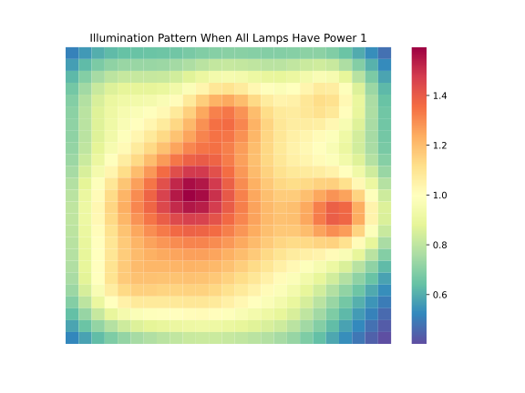
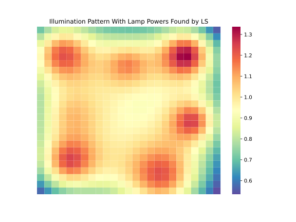
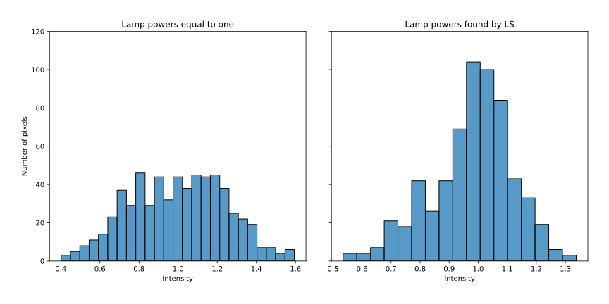

# Lamp Powers via Least Squares

*Numerical Optimization and Large Scale Linear Algebra*  
*MSc in Data Science, Department of Informatics*  
*Athens University of Economics and Business*

## *Table of Contents*

1. [Introduction](#introduction)
2. [Project Overview](#project-overview)
3. [Resources](#resources)
4. [Results](#results)

## *Introduction*

- A set of $n$ lamps illuminates an area that we divide into $m$ regions (pixels)
- We let $l_{i}$ denote the lighting level in region $i$
- We let $p_{i}$ denote the power at which lamp $i$ operates
- The vector of illumination levels is a linear function of the lamp powers
- Thus, we have $l=Ap$ for some $m \times n$ matrix $A$
- The $j$th column of $A$ gives the illumination pattern for lamp $j$
- The $i$th row of $A$ gives the sensitivity of pixel $i$ to the $n$ lamp powers
- The illumination decays with an inverse square law, so $A_{ij}$ proportional to $d^{-2}_{ij}$
- $d_{ij}$ is the $(3-D)$ distance between the center of the pixel and the lamp position
- The matrix $A$ is scaled so that when all lamps have power one, the average illumination level is one
- The desired illumination pattern is $1$, i.e., uniform with value $1$

## *Project Overview*

- Our mission is to find lamp powers that result in a desired illumination pattern $l^{des}$, such as $l^{des}=a·1$
- In other words, we seek $p$ so that $Ap≈l^{des}$
- We will use least squares to find $\hat{p}$ that minimizes the sum square deviation from the desired illumination
- In particular, we need to minimize $\|Ap-l^{des}\|_{2}^{2}$
- As an example, we will use $n=10$ lamps, the area being an $25\times25$ grid with $m=625$ pixels, each $1m^{2}$
- The $(x,y)$ positions of lamps and their heigh above floor are given
- In addition, we will create two graphs to show the illumination of the two patterns
- We will, also, calculate the RMSE in both cases
- Finally, we will create the histogram of patch illumination values for both cases

## *Resources*

- Packages: `numpy`, `pandas`, `matplotlib`, `seaborn`, `scipy`, `sklearn`
- Software: Jupyter Notebook

## *Results*

### Illumination Pattern When All Lamps Have Power 1

- With $p=1$, the resulting illumination pattern is shown in the figure below
- The RMS illumination error is $0.24$
- We can see that the corners are quite a bit darker than the center
- And there are pronounced bright spots directly beneath each lamp

### Illumination Pattern With Lamp Powers Found by LS

- Using least squares we find the following lamp powers:
  - $\hat{p} = (1.46, 0.79, 2.97, 0.74, 0.08, 0.21, 0.21, 2.05, 0.91, 1.47)$
- The resulting illumination pattern has an RMS error of 0.14
- The illumination pattern is shown in the figure below
- We can see that the illumination is more uniform than when all lamps have power 1
- Most illumination values are near the target level 1
- The corners are a bit darker and the illumination a bit brighter directly below each lamp

### Patch Illumination Values

- Below we can see the histograms of pixel illumination values using $p = 1$ and the estimates found by LS

