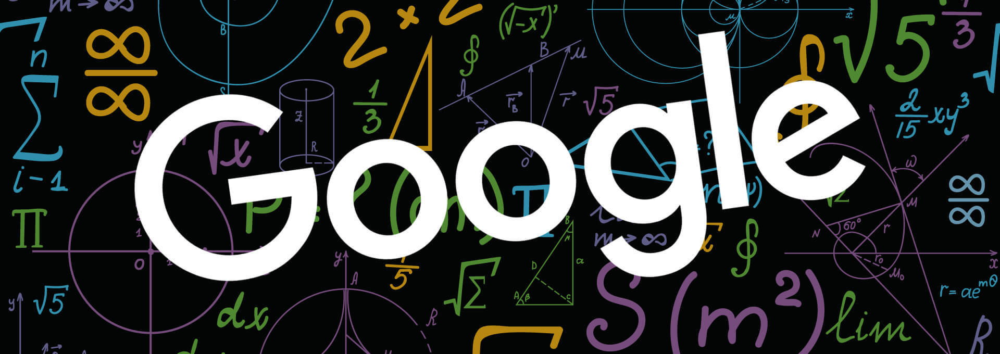

# PageRank

*Numerical Optimization and Large Scale Linear Algebra*  
*MSc in Data Science, Department of Informatics*  
*Athens University of Economics and Business*

## *Table of Contents*

1. [Introduction](#introduction)
2. [Project Overview](#project-overview)
3. [Data](#data)
4. [Resources](#resources)
5. [The 2 Methods](#the-2-methods)
6. [Results](#results)

## *Introduction*

- PageRank is an algorithm used by Google Search to rank web pages in their search engine results
- It is named after both the term "web page" and co-founder Larry Page
- PageRank is a way of measuring the importance of website pages
- According to Google, PageRank works by counting the number and quality of links to a page
- Doing so, it tries to determine a rough estimate of how important the website is
- The underlying assumption is that more important websites are likely to receive more links from other sites

## *Project Overview*

- We define functions both for the **Power method** and the iterative **Gauss-Seidel method**
- For both methods, we consider as  $\alpha=0.85 $ and stopping criterion  $\tau=10^{-8} $
- Also, the vector $\alpha$ having 1 if it corresponds to a node without outbound links, and 0 otherwise
- Then, using both methods, we find the PageRank vector $\pi$ and compare their results and performances
- We repeat the previous task, but now with $\alpha=0.99$ and we compare again their results and performances
- Furthermore, using both methods, we check if the components of $\pi$ converge at the same time to their limits
- We try to find which of them converge faster, *those that correspond to important nodes or to non important?*

## *Data*

- The file `Stanweb.dat.zip` contains the connectivity matrix for the webpages of Stanford University
- In the first column are contained the nodes, while in the second the node with which is connected
- The third column contains their weights

## *Resources*

- Packages: `numpy`, `pandas`, `matplotlib`, `scipy`
- Software: Jupyter Notebook

## *The 2 Methods*

### Power Method

- Power method is an eigenvalue algorithm
- Given a diagonizable matrix $A$, the algorithm will produce:
    - a number $\lambda$, which is the greatest (in absolute value) eigenvalue of $A$
    - a non-zero vector  $v $, which is a corresponding eigenvector of  $\lambda $, that is,  $Av=\lambda v $
- Power method is a very simple algorithm, but it may converge slowly
- The most time-consuming operation of the algorithm is the multiplication of matrix $A$ by a vector
- Therefore, this algorithm is effective for a very large sparse matrix with appropriate implementation

### Gauss-Seidel Method

- The Gauss-Seidel method is an iterative method used to solve a system of linear equations
- It is, also, known as the Liebmann method and is similar to the Jacobi method
- Theoritically, it can be applied to any matrix with non-zero elements on the diagonals
- However, convergence is only guaranteed if one of the following two conditions is met:
    - the matrix is strictly diagonally dominant, or
    - the matrix is symmetric and positive definite

## *Results*

- Based on the paper [Deeper Inside PageRank](https://github.com/sapaladas/msc_data_science/blob/main/q3-numerical_optimization_and_large_scale_linear_algebra/pagerank/readings/pagerank.pdf), the PageRank, using each method, can be calculated as follows:
- Power Method:  $x^{(k)T} = \alpha x^{(k-1)T} P + (\alpha x^{(k-1)T} a + (1-\alpha))v^T $
- Gauss-Seidel Method:  $\pi^{T}=(v_{1}^{T}(I-\alpha P_{11})^{-1} | \alpha v_{1}^{T}(I-\alpha P_{11})^{-1} P_{12} + v_{2}^{T}) $

**Power method vs Gauss-Seidel method, when $\alpha = 0.85$**

- Both methods return the same results for the first 30 nodes, while after that they start to differentiate
- The Power method solves the PageRank problem in **92 iterations** and takes **1.6** seconds to converge
- The Gauss-Seidel method needs only **49 iterations**, but it requires almost **150x time** to converge

|   | Power Method | Gauss-Seidel Method |
| :-: | :----------: | :-----------------: |
| Iterations | 92 | 49 |
| Wall Time (s) | 1.6 | 242.7 |

**Power method vs Gauss-Seidel method, when $\alpha = 0.99$**

- Now, both methods return the same results only for the first 10 nodes
- The Power method solves the PageRank problem in **1393 iterations** and takes **35 seconds** to converge
- The Gauss-Seidel method needs **less iterations** (610), but it requires **way a lot more time** (3812 seconds)

|   | Power Method | Gauss-Seidel Method |
| :-: | :----------: | :-----------------: |
| Iterations | 1393 | 610 |
| Wall Time (s) | 35.0 | 3812.4 |

#### Convergence Rate

- In general, higher ranked nodes need on average more iterations to converge than lower ranked nodes
- The reason is that the lower ranked nodes have more outbound links than inbound links
- This results in their pagerank converging relatively quickly
- On the contrary, higher ranked nodes tend to have many inbound links
- This results in the pagerank keep increasing until it converges
- And this makes perfect sense if we consider again, what PageRank is, in fact, and how it works
- PageRank works by counting the number and quality of links to a page
- Doing so, it tries to determine a rough estimate of how important the website is
- The underlying assumption is that more important websites are likely to receive more links from other sites

| Method | Avg Node Convergence Rate | N1 | N2 | N3 | N4 | N5 | N6 | N7 | N8 | N9 | N10 |
| :-: | :-----------------------: | :-: | :-: | :-: | :-: | :-: | :-: | :-: | :-: | :-: | :-: |
| PM w. 0.85 | 55 | 82 | 78 | 75 | 84 | 72 | 77 | 61 | 61 | 76 | 66 |
| PM w. 0.99 | 690 | 866 | 1346 | 957 | 942 | 890 | 959 | 868 | 751 | 751 | 1227 |
| GS w. 0.85 | 34 | 47 | 33 | 43 | 48 | 42 | 35 | 47 | 47 | 40 | 39 |
| GS w. 0.99 | 328 | 463 | 0 | 588 | 499 | 475 | 588 | 463 | 594 | 594 | 0 |
